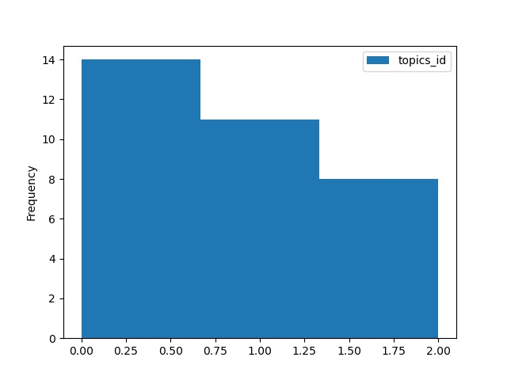

# ChatbotWiz 

## Code

Code is availalbe on GitHub at: [https://github.com/Vachonni/ChatbotWiz](https://github.com/Vachonni/ChatbotWiz)

Please, take the time to read the `README.md` file before this file.

## The task

From chatbot conversations to topic classification. 

Include the steps:

* Parsing 
* Topic modelling
* Topic classification training and evaluation
* (search)

### 1. Parse

Code is in `src/data/parse.py`.

Steps: 

1. Unquote 
2. Split by conversation
3. Split by event
4. Get the first message sent by the customer. 

The answer is saved in a dataframe (instead of a list, as asked). If you want it as a list, do: `df['first_msg_user'].to_list()`

### 2. Cluster

Code is in `src/modelling/topic_modelling.py`.

Used BERTtopic package. Reference here: [https://pypi.org/project/bertopic/](https://pypi.org/project/bertopic/). There are a lot of visualization tools to play with ;) 

It could have been done with LDA.

The 3 topics are formed with these 3 sets of words. They correspond to the most frequent words in the cluster that are less in the other clusters.

1. code password log new
2. printer print scan attached 
3. ticket follow
 
NOTE: Topic #3 has only 2 words since the others were repeating these exact words in a uni-gram/bi-gram or are in a different order in bi-gram.

### A. Predict

I have trained 2 models and evaluated 3 models, using a pretrained one.

All evaluations are performed in `src/modelling/evaluate.py`, and the results are in the **Results** section below.

Prior to the training and evaluation, I did a quick EDA and I split the data in a stratified manner, even if the classes are quite balanced.   

#### Basic classifier

Code is in `src/modelling/clf_base.py`.

I have implemented a linear SVM with SGD training from [Sklearn](https://scikit-learn.org/stable/modules/generated/sklearn.linear_model.SGDClassifier.html).

I used a Sklearn pipeline to include the text embedding steps (bag-of-word vectorization and tf-idf)

#### Classifier with hyper-parameter tuning

Code is in `src/modelling/clf_HP_Search.py`.

I performed a hyper-parameter search using the same model (and pipeline) as in the basic classifier case. 

#### Transformer model with zero-shot-classification model

Code is in `src/modelling/evaluate.py`, as no training was necessary,

I used the topic names exactly as described in **2.Cluster**. 

It is possible to choose your embedding model, even one you fine-tune on your data. Here, I just used the default one.

#### Other

Obviously, with a lot of resources and data, training your own transformer model would probably give the best solutions as context might be necessary when determining a topic.

### B. Search

I haven't completed this task.  

A possible high-level solution:

1. Embedding of questions and messages
2. Ranking the different message's embeddings according to their distance to the question's embedding. The closer, the better.

Tools to achieve this solution:

1. If resources are not an issue, go for `sentence_transformers` from HuggingFace [here](https://huggingface.co/sentence-transformers), choosing the model according to the needs (resources, language,...). If resources need to be optimized, go for simple tf-idf as in **A.Predict** task.
2. Any vector distance evaluation can do it. Choose wisely according to your KPIs. A good tool is the one developed by Meta, [Faiss](https://engineering.fb.com/2017/03/29/data-infrastructure/faiss-a-library-for-efficient-similarity-search/) 

## Results

### Scores

| Model              | CV - Acc - Mean | CV - Acc - Std |  Test - Accuracy | Test - f1 weighted |
| :---               |    :----:       | :---:          |:----:            |          :---:     |
| **clf base**       | 0.87		      | 0.16           | 0.86             | 0.86               |
| **clf HP search**  | 0.93            | 0.13           | 0.86             | 0.86               |
| **HGF Zero Shot**  | -               | -              | 1.00             | 1.00               |

Both **clf base** and **clf HP search** provide the same results on the test set. Still, we can see from the Cross-Validation (CV) evaluation that the model resulting from the hyper-parameter search is more precise (less bias) and more stable (less variance).

The zero-shot classification model from Huggingface achieves the best results on the test set. This might be explained by the tiny amount of data available to train the classifiers.

Confusion matrices are also output by the algorithm. Both classifier trained in this exercice have the same result, indicating a topic 1 being predicted as topic 2.

| 2          | 1             | 0     |
| :---:      |    :----:     | :---: |          
| **0**      | **2**         | **0**    |
| **0**      | **0**         | **2**     |        

### Ressources: Time & compute

When time and computing resources are essential to consider, it might be worth it to go for a less-performing model. It's a trade-off.

